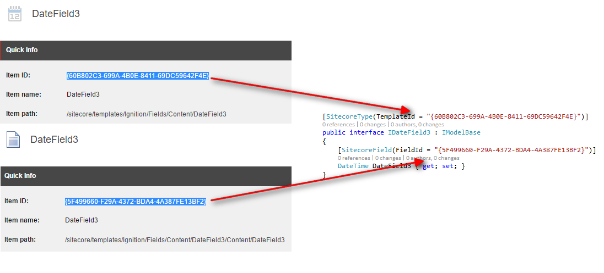

*********************************************************
Adding additional field definitions to Ignition Framework
*********************************************************

In this example we will be creating a third DateTime field.
In Sitecore:

===========================================
Create a template for the field in Sitecore
===========================================

#. Create a new template in ``/sitecore/templates/Ignition/Fields/Content``
#. Name the template ``DateTime3``.
#. For the base template, select ``Templates/Ignition/ItemBase``
#. Assign your new template an icon. (For this example we will use ``Business/32x32/calendar.png``)
#. On the template’s builder tab, create a section called ``Content`` and create the field ``DateTime3`` of type ``Datetime``.

==================================================
Create an interface for the field in Visual Studio
==================================================

#. Navigate to ``Ignition/Data/Ignition.Data/Fields``
#. Create a new interface called ``IDateTime3``.
#. Create using references for:

	* System;
	* Glass.Mapper.Sc.Configuration.Attributes;
	* Ignition.Core.Models.BaseModels;

#. Mark the interface declaration ``public``, and add inheritance to ``IModelBase``. 
#. Above the interface declaration, add the ``SitecoreType`` attribute. Specify the ``TemplateId`` property to match the Item Id of the newly created DateTime3 **template** item in Sitecore. (See screenshot)
#. Add the DateField3 property. Add a ``SitecoreField`` attribute to this property, and specify the attribute’s ``FieldId`` property to match the Item Id of the DateTime3 **template field** item in Sitecore. (See screenshot)

The completed interface for the new field should look like the example below.

**Note: The GUIDs are generated randomly, so your template ID and field ID will not match the IDs given in this example. You must manually copy your own IDs from Sitecore to this interface in Visual Studio.** ::

	using System;
	using Glass.Mapper.Sc.Configuration.Attributes;
	using Ignition.Core.Models.BaseModels;
	namespace Ignition.Data.Fields
	{

	   [SitecoreType(TemplateId = "{60B802C3-699A-4B0E-8411-69DC59642F4E}")]
	   public interface IDateField3 : IModelBase
	   {
	       [SitecoreField(FieldId = "{5F499660-F29A-4372-BDA4-4A387FE13BF2}")]
	       DateTime DateField3 { get; set; }
	   }
	}

============
Finishing up
============

Build the Ignition.Data project and re-publish. The newly-created field should now be usable on all ignition-based pages.